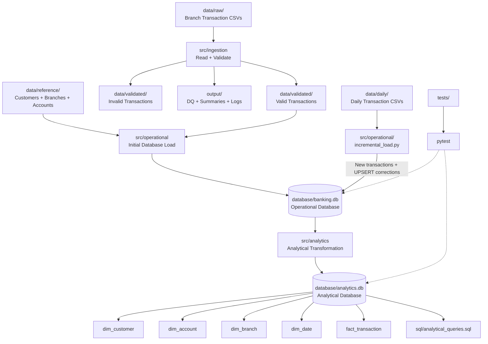

# Incremental Banking Pipeline + Analytical Layer

## 1. Project Overview

This project implements a Python and SQLite banking data pipeline that processes transaction data, validates incoming records, maintains an operational relational database, and builds a separate analytical database for reporting.

The project extends the earlier banking pipeline with **incremental daily transaction processing**, **correction handling using UPSERT**, **rerun-safe processing**, and an **analytical star-schema layer**.

### Overall Architecture



### Data Flow

The main data flow is:

```text
Raw branch CSV files
        ↓
Ingestion and validation
        ↓
Validated transactions
        ↓
banking.db
        ↓
Incremental daily processing
        ↓
banking.db updated with new/corrected transactions
        ↓
Analytical transformation
        ↓
analytics.db
        ↓
Analytical SQL queries
```

The analytical database is built from trusted relational data in `banking.db`, not directly from the raw branch CSV files.

---

## 2. Repository Structure

```text
banking_data_pipeline/
│
|- README.md
|- requirements.txt
|
├── config/
│   ├── __init__.py
│   └── config.py
│
├── data/
│   ├── raw/
│   ├── reference/
│   ├── validated/
│   └── daily/
│
├── src/
│   ├── ingestion/
│   │   ├── __init__.py
│   │   ├── pipeline.py
│   │   ├── validation.py
│   │   └── dq_metrics.py
│   │
│   ├── operational/
│   │   ├── database.py
│   │   ├── incremental_load.py
│   │   ├── integrity_tests.py
│   │   ├── run_query.py
│   │   └── schema.sql
│   │
│   └── analytics/
│       ├── __init__.py
│       ├── analytics.py
│       ├── analytics_schema.sql
│       └── run_query.py
│
├── output/
│   ├── logs/
│   ├── dq/
│   └── summaries/
│
├── database/
│   ├── banking.db
│   └── analytics.db
│
├── sql/
│   ├── operational_queries.sql
│   └── analytical_queries.sql
│
├── tests/
│   ├── fixtures/
│   ├── test_pipeline.py
│   ├── test_validation.py
│   ├── test_database.py
│   ├── test_incremental_load.py
│   └── test_analytics.py
│
├── evidence/
│   ├── earlier_pipeline/
│   ├── class_4/
│   └── week_5/
│
└── docs/
    ├── erd/
    │   └── ER Diagram.png
    └── analytics/
        └── star_schema.md

```

---

# 3. Ingestion and Validation

## Raw Data

The original branch transaction files are stored in:

```text
data/raw/
```

The reference data used to build the operational database is stored in:

```text
data/reference/
```

This includes:

* `customers.csv`
* `branches.csv`
* `accounts.csv`

The ingestion pipeline discovers CSV files from the raw-data directory and reads them using pandas.

## Validation

The ingestion layer checks required transaction fields and validates:

* `transaction_id`
* `account_id`
* `transaction_date`
* `transaction_type`
* `amount`
* `currency`
* duplicate transaction IDs

The accepted transaction types are:

```text
CREDIT
DEBIT
```

The required currency is:

```text
USD
```

Amounts must be numeric and greater than zero.

Dates must use a valid `YYYY-MM-DD` format and represent an actual calendar date.

Invalid records are not loaded into the operational database.

## Validated and Invalid Data

After ingestion:

```text
data/validated/valid_transactions.csv
data/validated/invalid_transactions.csv
```

contain the valid and rejected records respectively.

---

# 4. Logs, Data Quality and Run Summaries

The pipeline generates runtime logs in:

```text
output/logs/
```

Data-quality metrics are written to:

```text
output/dq/
```

Run summaries are written to:

```text
output/summaries/
```

The DQ output includes information such as:

* total rows read
* valid rows
* invalid rows
* rejection rate
* missing fields
* invalid transaction types
* invalid amounts
* invalid dates
* invalid currency
* duplicate transaction IDs
* files discovered
* files successfully read
* files skipped

---

# 5. Running Ingestion and Validation

From the project root:

```powershell
python -m src.ingestion.pipeline
```

The pipeline reads the CSV files from:

```text
data/raw/
```

and produces validated data and data-quality outputs.

The original pipeline currently produces:

```text
Total records: 24
Valid records: 10
Invalid records: 14
```

---

# 6. Operational Database

The operational database is:

```text
database/banking.db
```

It contains:

```text
customer
branch
account
transactions
```

The relationships are:

```text
customer
   ↓
account
   ↓
transactions

branch
   ↓
account
```

The transaction table uses `transaction_id` as its primary key.

Foreign-key constraints are enabled using:

```python
PRAGMA foreign_keys = ON
```

---

## 7. Creating and Loading `banking.db`

The operational database can be created using:

```powershell
python -m src.operational.database
```

This creates the database if it does not already exist, using the operational schema and loading:

1. customers
2. branches
3. accounts
4. validated transactions

The initial database contains:

```text
customer: 6
branch: 3
account: 10
transactions: 10
```

The initial database build is a full-load operation and is intentionally separate from the Week 5 incremental processing.

If `banking.db` already exists, the command does not delete or rebuild it. It skips the full load to protect existing operational data.

For Week 5 daily processing, use:

```powershell
python -m src.operational.incremental_load
```

The incremental loader keeps the existing database and applies new transactions and corrections using `INSERT`/`UPDATE` (UPSERT) behavior.


---

# 8. Week 5 Incremental Processing

The Week 5 daily transaction files are stored in:

```text
data/daily/
```

The supplied daily files are:

```text
transactions_20260907.csv
transactions_20260908.csv
transactions_20260909.csv
```

These files contain new transactions as well as later corrections to previously stored transactions.

A daily file can be processed using:

```powershell
python -m src.operational.incremental_load
```

The incremental loader reads one daily CSV file and applies its transactions to `banking.db`.

---

# 9. New Transactions

When a transaction ID does not already exist in `transactions`, the transaction is inserted.

For example, the daily files introduced transaction IDs such as:

```text
T4001
T4002
T4003
T4004
T4005
T4006
T4007
T4008
T4009
T4010
```

After processing the supplied daily files, the operational database contains:

```text
20 transactions
```

---

# 10. Corrections and UPSERT

The incremental loader uses SQLite UPSERT behavior:

```sql
ON CONFLICT(transaction_id) DO UPDATE SET
```

This means that when a transaction ID already exists, the later supplied record updates the stored transaction instead of creating a duplicate.

Examples:

```text
T1001
500.0 → 550.0
```

and:

```text
T4002
50.0 → 55.0
```

This is why `INSERT OR IGNORE` is not sufficient for this pipeline. `INSERT OR IGNORE` would keep the existing row unchanged when the later file contains a correction.

The transaction ID acts as the business key used to identify the existing transaction.

---

# 11. Rerun Safety

The incremental process is designed to be safe to rerun.

If the same daily file is processed again:

* existing transaction IDs are matched
* the existing rows are updated with the same supplied values
* new duplicate rows are not created

For example, after processing the Sept 9 file:

```text
Transaction count: 20
```

After processing the same file again:

```text
Transaction count: 20
```

The correction to `T4002` also remains:

```text
T4002 → 55.0
```

Therefore, rerunning the same batch does not increase the business transaction count or reverse a previously applied correction.

---

# 12. Analytical Layer

The analytical database is:

```text
database/analytics.db
```

It is kept separate from the operational database.

The analytical layer is built from trusted data in:

```text
database/banking.db
```

using:

```text
src/analytics/analytics.py
```

The analytical schema contains:

```text
dim_customer
dim_account
dim_branch
dim_date
fact_transaction
```

The final analytical table counts are:

```text
dim_customer: 6
dim_branch: 3
dim_account: 10
dim_date: 4
fact_transaction: 20
```

---

# 13. Fact Grain

The grain of `fact_transaction` is:

> **One row represents one banking transaction identified by `transaction_id`.**

This grain is defined before building the fact table because it determines what each row represents and prevents accidental duplication or mixing of different levels of detail.

At the declared grain:

```text
20 unique transactions
=
20 fact_transaction rows
```

---
# 14. Fact and Dimension Model

The analytical model contains one central fact table:

```text
fact_transaction
```

and descriptive dimension tables:

```text
dim_customer
dim_account
dim_branch
dim_date
```

The fact table stores transaction-level information and the keys needed to connect each transaction directly to the relevant dimensions:

```text
transaction_id
customer_id
account_id
branch_id
transaction_date
transaction_type
amount
currency
```

The dimensions provide descriptive context for analysis.

```text
                 dim_customer
                      |
                      v
dim_branch ----> fact_transaction <---- dim_account
                      ^
                      |
                   dim_date
```

For example:

* `dim_customer` describes the customer.
* `dim_account` describes the account.
* `dim_branch` describes the branch.
* `dim_date` describes the transaction date.
* `fact_transaction` records each banking transaction and directly references the relevant customer, account, branch, and date.

The fact table has a grain of **one row per banking transaction**, identified by `transaction_id`.

The analytical star-schema documentation is stored in:

```text
docs/analytics/star_schema.md
```

---


# 15. Analytical SQL Queries

The analytical queries are stored in:

```text
sql/analytical_queries.sql
```

There are seven analytical queries covering:

1. Transaction count and total amount by branch
2. Transaction count and total amount by transaction type
3. Transaction activity by customer
4. Transaction activity by date
5. Transaction activity by customer and branch
6. Average transaction amount by account type
7. Largest individual transactions

The queries are executed individually using:

```text
src/analytics/run_query.py
```

This approach makes it easier to run, verify and capture the result of each query separately.

---

# 16. Operational SQL

Operational SQL queries are stored in:

```text
sql/operational_queries.sql
```

The operational query runner is:

```text
src/operational/run_query.py
```

It connects to:

```text
database/banking.db
```

and executes the selected SQL query.

For example:

```powershell
python -m src.operational.run_query
```

---

# 17. Running Analytical SQL

The analytical query runner is:

```text
src/analytics/run_query.py
```

Run it with:

```powershell
python -m src.analytics.run_query
```

The SQL inside the runner can be changed to the required analytical query.

The runner connects to:

```text
database/analytics.db
```

and prints the returned rows.

---

# 18. Testing

Tests are implemented using `pytest`.

Run the complete test suite with:

```powershell
python -m pytest -v
```

Week 5 specifically adds tests for:

### Incremental processing

* new transaction insertion
* correction of an existing transaction
* rerunning the same daily batch

### Analytical layer

* fact rows reference valid dimensions
* fact transaction IDs are unique
* a known analytical query returns the expected result

The six Week 5 tests all passed.

---

# 19. Test Fixtures and Evidence

Test fixtures are stored in:

```text
tests/fixtures/
```

These include scenarios used by the earlier ingestion and validation tests.

Assessment evidence is separated by project stage:

```text
evidence/
├── earlier_pipeline/
├── class_4/
└── week_5/
```

### earlier_pipeline

Contains useful earlier regression and manual test evidence from the previous pipeline work.

### class_4

Contains Class 4 operational database evidence such as:

* database loading results
* integrity test results
* returned SQL results
* before/after `EXPLAIN QUERY PLAN` results

### week_5

Contains evidence for:

* incremental processing
* new transaction insertion
* corrections
* rerun safety
* final operational database counts
* final analytical database counts
* analytical query results
* Week 5 pytest results

---

# 20. Dependencies

The project uses Python and SQLite.

The main Python dependencies are:

```text
pandas
pytest
```

SQLite is provided through Python's standard-library `sqlite3` module.

The project does not require:

* Spark
* Airflow
* dbt
* Docker
* Kafka
* cloud services
* a separate database server

---

# 21. Assumptions and Limitations

### Assumptions

* The supplied daily transaction files are treated as trusted, already-valid inputs for the Week 5 incremental stage.
* `transaction_id` uniquely identifies a banking transaction.
* Later records with an existing `transaction_id` represent corrections to that transaction.
* The transaction amount is stored as a positive value for both CREDIT and DEBIT transactions.
* `USD` is the required currency for the supplied transaction data.
* The analytical layer is derived from trusted data in `banking.db`.

### Limitations

* The pipeline uses local CSV files and SQLite rather than a production database or distributed processing system.
* The incremental loader processes supplied daily files explicitly rather than implementing automated file discovery or CDC.
* No Slowly Changing Dimension Type 2 implementation is included.
* No historical dimension-version tracking is implemented.
* The analytical date dimension contains only the dates required by the available transaction data.
* The project does not calculate account balances or signed net cash flow from the transaction amounts.
* The project does not use Spark, Airflow, dbt, Kafka, Docker, cloud infrastructure or a server-based database.

---

# 22. Week 5 Concept Answers

## 1. What is the grain of `fact_transaction` and why is it defined first?

The grain of `fact_transaction` is one row per banking transaction identified by `transaction_id`. Defining the grain first establishes exactly what each fact row represents and helps prevent duplicate or incorrectly aggregated data.

## 2. What is the difference between a full load and an incremental load?

A full load rebuilds or reloads the target database from the complete available source data. An incremental load processes only new or changed data and applies those changes to the existing database.

## 3. Why is `INSERT OR IGNORE` insufficient for corrections?

`INSERT OR IGNORE` ignores a new record when its primary key already exists. Therefore, if a later file contains a corrected value for an existing `transaction_id`, the old value would remain unchanged.

## 4. What makes the implementation rerun-safe?

The transaction ID is used as the unique business key and the incremental loader uses UPSERT behavior. Processing the same daily file again therefore updates the existing transaction rather than creating another transaction row.

## 5. What is the difference between a fact and a dimension?

A fact table stores measurable business events at a defined grain, such as banking transactions and their amounts. Dimension tables store descriptive information that provides context for analyzing those facts, such as customers, accounts, branches and dates.
