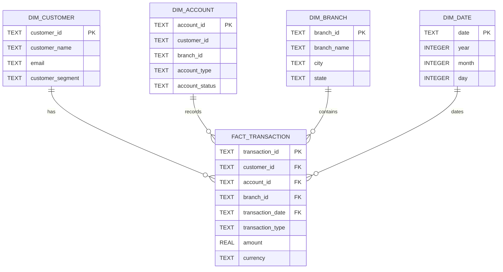

# Analytical Star Schema

The analytical layer uses `fact_transaction` at the grain of one banking transaction. The fact table directly connects to the customer, account, branch, and date dimensions.

### Fact grain

One row in `fact_transaction` represents **one banking transaction identified by `transaction_id`**.

The fact table stores transaction-level measures and the foreign keys needed to connect each transaction directly to the customer, account, branch, and date dimensions. The dimension tables provide descriptive information used for analysis.
