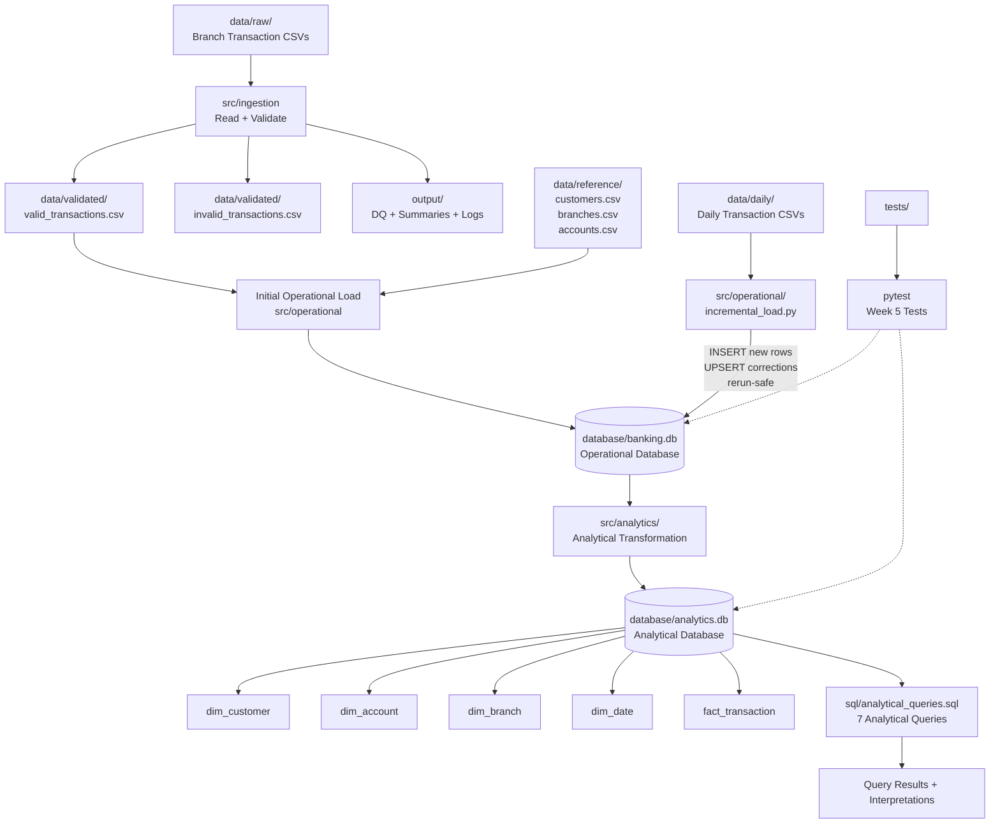

# Architecture and Data Lineage

The Week 5 pipeline processes raw branch transaction files through validation, loads trusted transactions into the operational database, and then transforms the trusted relational data into a separate analytical database.

## Data Flow

1. **Raw branch files** are read by the ingestion layer.
2. The ingestion layer validates the records and separates valid and invalid transactions.
3. Trusted transactions and reference data are loaded into `banking.db`.
4. New daily transaction files are processed separately through the incremental loader.
5. New transaction IDs are inserted, while later corrections for existing transaction IDs are applied using UPSERT.
6. The trusted operational data in `banking.db` is used as the source for the analytical transformation.
7. The analytical transformation creates `analytics.db` containing dimensions and the `fact_transaction` table.
8. The analytical queries operate on `analytics.db` rather than directly on the raw CSV files.
9. Pytest verifies incremental processing and analytical-layer integrity.
